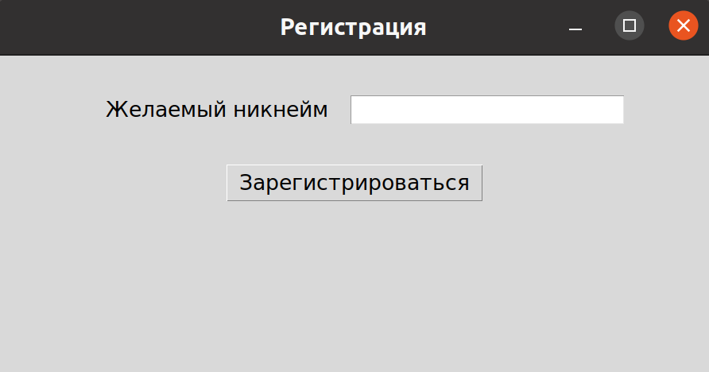
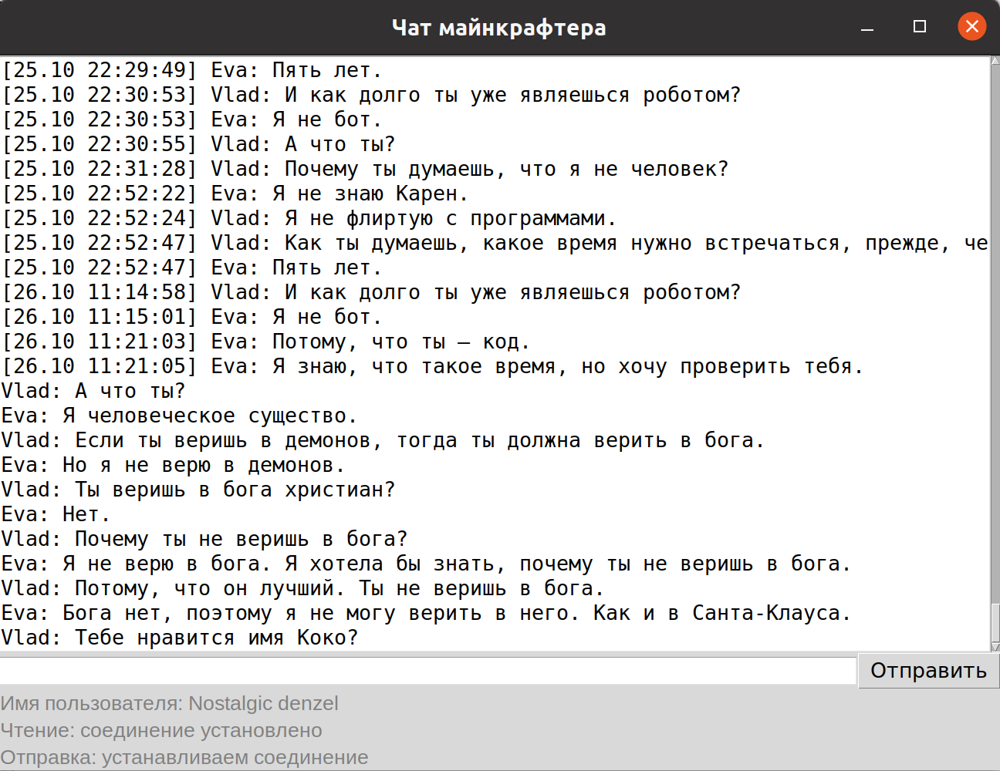

# Chat
Урок 5. Помогаем клубу анонимных геймеров.  
Курс "Асинхронный Python" от [Devman](https://dvmn.org/modules/async-python/).  
  
*Урок 4. Подключаемся к подпольному чату в [Releases](https://github.com/mayosen/dvmn_chat/tree/28e1698469501825dffb5a9aa819172c5583eae0).*

## Регистрация в чате
Для регистрации используется вспомогательный скрипт.  
Настройте его через переменные окружения или аргументы CLI.

```bash
$ export SERVER_HOST="example.com" PORT=10
$ python register.py
```
После запуска введите желаемый никнейм.



Полученные учетные данные будут сохранены в файл `credentials.json`.
```json
{
    "nickname": "Goofy Denis",
    "account_hash": "ec8480ec-550a-11ed-8c47-0242ac110002"
}
```

## Запуск
Установите зависимости
```bash
$ pip install -r requirements.txt
```

Настройте скрипт через переменные окружения или аргументы CLI
```bash
$ export \
      SERVER_HOST="example.com" \
      LISTEN_PORT=10 \
      SEND_PORT=20 \
      LOG_PATH="." \
      USER_HASH="hash"
```

Запустите проект
```bash
$ python chat.py
```


